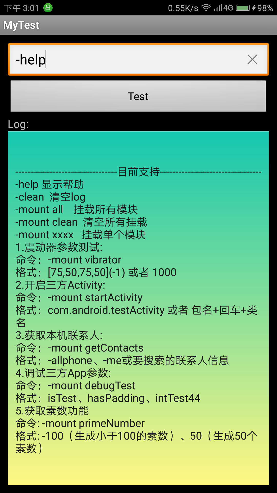

# MyTest
用于方便测试代码，界面简单，一个输入框一个按钮一个log输出框。

-help 显示帮助 
-clean  清空log 
-mount all    挂载所有模块 
-mount clean  清空所有挂载 
-mount xxxx   挂载单个模块 
1.震动器参数测试: 
-mount vibrator 
格式: \[75,50,75,50\]\(-1\) 或者 1000 
2.开启三方Activity: 
-mount startActivity 
格式: com.android.testActivity 或者 包名+回车+类名 
3.获取本机联系人 
-mount getContacts 
格式: -allphone、-me或要搜索的联系人信息  
4.调试三方App参数: 
-mount debugTest 
格式: isTest、hasPadding、intTest66 
5.获取素数功能: 
-mount primeNumber 
格式: -100（生成小于100的素数）、50（生成50个素数） 

截图：

